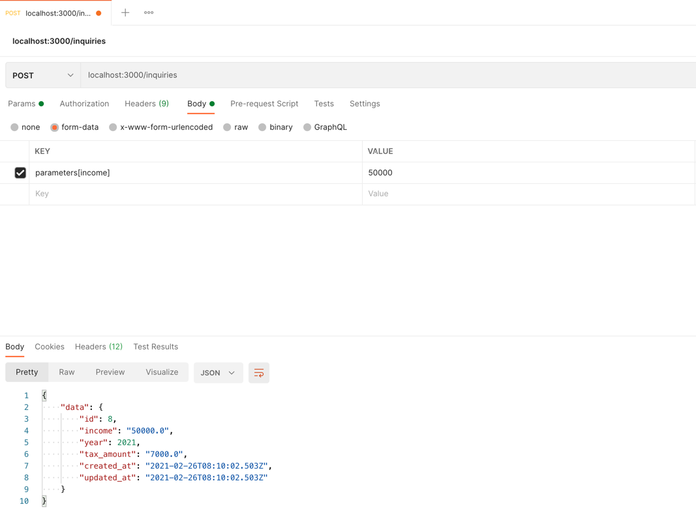

# README

Bracketed Tax Engine:

* Ruby version: `2.5.8`

* System dependencies: `sqlite`

* Database creation: `rails db:create`

* Database initialization: `rails db:migrate`

* How to run app: `rails s`
  
* How to run the test suite: `rspec`

* How to test API: 
  * send POST request to `{domain}/inquiries` with following required attribute `parameters[income]:{income}`
  * e.g. `curl --location --request POST 'localhost:3000/inquiries' --form 'parameters[income]="50000"'`
  
  * to get tax calculations for 100 users we'd need to send 100 separate POST requests
  * to scale application we'd have to spin multiple app instances and set load-balancer(nginx) in front of them
  

* Tax brackets(with 50+ brackets) for the next and previous years should be stored in `config/tax_brackets` folder.
  * e.g. `config/tax_brackets/2022.yml`
  * tax calculation inquiry is processed for the current year
  * to reduce Big O time complexity max_tax_amount is precalculated for each tax bracket
  * In case of huge service load - async tax calculation should be enabled by setting `ENV['async_tax_amount_calculation'] = true`
    * That would enable job queues usage to run CalculateTaxAmount service:
      * Attach queue adapter `sidekiq`/`resque`...
      * Add user notifications about tax_amount calculation
* Business logic is separated into CalculateTaxAmount service class
  * CalculateTaxAmount is called in before_create(sync)/after_create(async) hook of Inquiry model
* Tax calculations inquiries are saved into inquiries table of the DB
  * income and year fields are required and validated by min and max values
  
